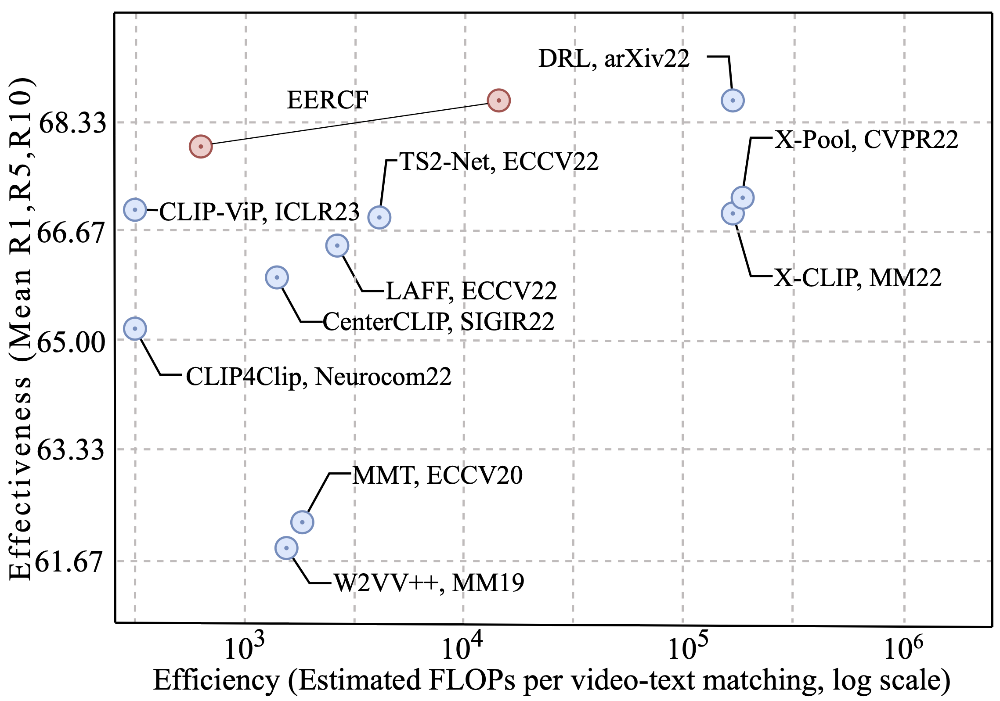

# EERCF(AAAI2024)
Code for [Towards Efficient and Effective Text-to-Video Retrieval with Coarse-to-Fine Visual Representation Learning](https://arxiv.org/abs/2401.00701). Our paper is accepted by AAAI2024.

## Introduction


Text-to-video retrieval methods based on CLIP have experienced rapid development. Those methods with impressive performance often design a heavy fusion block for sentence (words)-video (frames) interaction, regardless of the prohibitive computation complexity. 

We propose a two-stage text-to-video retrieval strategy that **strikes the optimal balance between effectiveness and efficiency**, facilitating the practical implementation.


## Requirement
```sh
# From CLIP
conda install --yes -c pytorch pytorch=1.7.1 torchvision cudatoolkit=11.0
pip install ftfy regex tqdm
pip install opencv-python boto3 requests pandas
```
## Data Preparing
Please refer to [ArrowLuo/CLIP4Clip](https://github.com/ArrowLuo/CLIP4Clip) to get data annotation. 

## Train and Eval

* Download CLIP Model
```sh
cd modules
wget https://openaipublic.azureedge.net/clip/models/40d365715913c9da98579312b702a82c18be219cc2a73407c4526f58eba950af/ViT-B-32.pt
# wget https://openaipublic.azureedge.net/clip/models/5806e77cd80f8b59890b7e101eabd078d9fb84e6937f9e85e4ecb61988df416f/ViT-B-16.pt
# wget https://openaipublic.azureedge.net/clip/models/b8cca3fd41ae0c99ba7e8951adf17d267cdb84cd88be6f7c2e0eca1737a03836/ViT-L-14.pt
```

* Train on MSR-VTT-1k.
```sh
mkdir weight
python -m torch.distributed.launch --nproc_per_node=4 main_eercf.py   --rerantopk 50 --multi_augmentation --do_train --num_thread_reader=8 --lr 1e-4 --batch_size=240  --batch_size_val 240 --epochs=5  --n_display=10 --train_csv data/MSRVTT/msrvtt_data/MSRVTT_train.9k.csv --val_csv data/MSRVTT/msrvtt_data/MSRVTT_JSFUSION_test.csv --test_csv data/MSRVTT/msrvtt_data/MSRVTT_JSFUSION_test.csv --multi_data_path data/MSRVTT/msrvtt_data/MSRVTT_data.json --data_path data/MSRVTT/msrvtt_data/MSRVTT_data.json --features_path data/MSRVTT/data/MSRVTT/videos/frames --output_dir weight --max_words 32 --max_frames 12 --datatype msrvtt --expand_msrvtt_sentences  --feature_framerate 1 --coef_lr 1e-3 --feature_framerate 1 --coef_lr 1e-3 --freeze_layer_num 0  --slice_framepos 2 --loose_type --linear_patch 2d --sim_header seqTransf --pretrained_clip_name ViT-B/32

```

* Eval on MSR-VTT-1k.
Download weight trained on MSR-VTT-1k (Reported in the paper) from [Google Driver](https://drive.google.com/file/d/1eeEQ1_0sSzHc8NpvG6HLSpFNDdkQRmUu/view?usp=drive_link).

```sh
python -m torch.distributed.launch --nproc_per_node=1 main_eercf.py --init_model weight/pytorch_model.bin.0    --rerantopk 50 --multi_augmentation --do_eval --num_thread_reader=8 --lr 1e-4 --batch_size=240  --batch_size_val 240 --epochs=5  --n_display=10 --train_csv data/MSRVTT/msrvtt_data/MSRVTT_train.9k.csv --val_csv data/MSRVTT/msrvtt_data/MSRVTT_JSFUSION_test.csv --test_csv data/MSRVTT/msrvtt_data/MSRVTT_JSFUSION_test.csv --multi_data_path data/MSRVTT/msrvtt_data/MSRVTT_data.json --data_path data/MSRVTT/msrvtt_data/MSRVTT_data.json --features_path data/MSRVTT/data/MSRVTT/videos/frames --output_dir weight/eval_result --max_words 32 --max_frames 12 --datatype msrvtt --expand_msrvtt_sentences  --feature_framerate 1 --coef_lr 1e-3 --feature_framerate 1 --coef_lr 1e-3 --freeze_layer_num 0  --slice_framepos 2 --loose_type --linear_patch 2d --sim_header seqTransf --pretrained_clip_name ViT-B/32

```

## Citation

```bibtex
@InProceedings{Tian_2024_AAAI,
    author    = {Tian, Kaibin and Cheng, Yanhua and Liu, Yi and Hou, Xinglin and Chen, Quan and Li, Han},
    title     = {Towards Efficient and Effective Text-to-Video Retrieval with Coarse-to-Fine Visual Representation Learning},
    booktitle = {Proceedings of the AAAI Conference on Artificial Intelligence(AAAI)},
    year      = {2024}
}
```

## License
This project is released under the MIT license. Please see the LICENSE file for more information.

## Acknowledge
Our code is based on [ArrowLuo/CLIP4Clip](https://github.com/ArrowLuo/CLIP4Clip) and [DRL](https://github.com/foolwood/DRL/tree/main)
